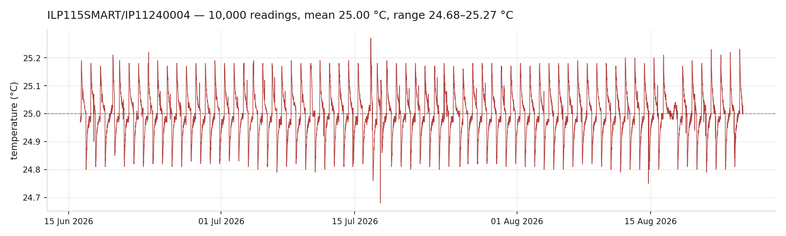
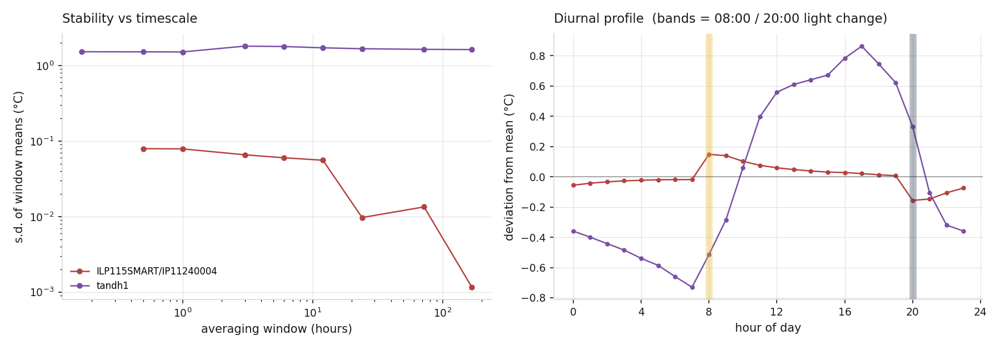

# pico-incubator — log archive

Permanent record of the cell-culture incubator: light cycle, board restarts,
and temperature.

This repository is an **archive**. The firmware that produced these logs is no
longer developed here — it was folded into `pico_firmware`, which unified all
Pico-controlled devices in the lab. The original code is preserved twice:

- the **`legacy` branch** — this repository exactly as it was before the
  reorganisation
- the **`legacy/` folder** on `main`, for convenience

The legacy code targets a **different circuit board** to the one in service
now. See `legacy/README.md`.

> Maintained by Claude. The parser, the figures and the CI that regenerates
> them are Claude's work, reviewed by Yatharth.

---

## Adding logs

1. Pull the files off the device.
2. Drop them in a folder named for the date you retrieved them, ISO format:
   `logs/YYYY-MM-DD/`.
3. Commit and push.

Everything below regenerates itself. Nothing to run locally.

Both the Pico's own `.txt` logs and instrument CSV exports (the Memmert ILP
series) can go in the same folder; the parser recognises each by shape.

---

## Figures

### Temperature and humidity


Two eras, on one axis. The Pico's DHT sensor (2023–24) recorded a room that
swung between 19 and 28 °C. The ILP 115 SMART (2026) holds 25 °C — its trace is
the flat line, which is why it gets its own plot below.

### The controlled incubator



### Stability



**Left** — standard deviation of block means against block length. Flat means
white noise that averaging cannot remove; a fall means averaging helps. The
ILP 115 sits ~20× below the old setup at ten minutes and averages down to
0.001 °C over a week. The old sensor is flat at ~1.5 °C: that is not sensor
noise, it is a room with no temperature control.

**Right** — mean temperature by hour of day. The two profiles have different
causes. The old trace is a broad curve peaking around 17:00: room heating. The
ILP 115 steps sharply at 08:00 and drops at 20:00, exactly on the light
transitions — **the LED matrix warms the chamber by about 0.3 °C
peak-to-trough.** The cells see a small thermal cycle locked to the light cycle.

### Light phase transitions


Two dense columns at 08:00 and 20:00 are the scheduled transitions. The scatter
through the working day is the boot-time phase detection that runs whenever the
circuit file is re-executed.

### Board restarts


A restart is a bare channel-name line — the header the Logger writes on import.
It carries no timestamp, so each is dated from the first record of that boot.
Boots whose clock never synced cannot be dated; they are excluded from the bars
and counted in the title. The folder name is only the retrieval date and is
never used as a time axis.

### Archive coverage


### Interactive

`plots/interactive.html` — Bokeh, pan/zoom/hover over every reading, series
toggled from the legend.

**GitHub cannot display it.** README HTML is sanitised, and files viewed in the
repo are shown as source. It is published as a build artifact instead: open the
latest run under the **Actions** tab and download `interactive-plot`. About
5 MB, so it is deliberately not committed.

---

## How it works

`.github/workflows/archive.yml`, on every push touching `logs/` or `tools/`:

1. `tools/parse_logs.py` — walks `logs/*/`, writes `tandh.csv` and `events.csv`
2. `tools/make_plots.py` — writes the PNGs into `plots/`
3. commits the regenerated files back, and uploads `interactive.html` as an
   artifact

`parse_logs.py` is standard library only. `make_plots.py` needs matplotlib and
numpy; bokeh is optional and skipped if absent.

---

## The data

| | |
|---|---|
| Retrievals | 18, from 2023-08-26 to 2026-08-24 |
| Temperature | 92,781 readings |
| — Pico DHT (`tandh1`) | 82,781, 2023-08-19 → 2024-02-12, with humidity |
| — Memmert ILP 115 SMART | 10,000, 2026-06-16 → 2026-08-24, temperature only |
| Event records | ~29,000 |
| Board restarts | 1,406 (1,030 dated, 376 with no clock) |

### Log format — Pico

One record per line:

```
<channel>, (Y, M, D, weekday, hh, mm, ss, subsec), <message>
```

A bare channel name on its own line is the header written when the logger is
imported — **one board restart**. All four channels write a header at boot, so
counting restarts across every channel over-counts about fourfold;
`make_plots.py` counts only `out`.

| file | content |
|---|---|
| `out.txt` | boots, scheduler setup, day/night transitions |
| `err.txt` | NTP clock-sync records |
| `tandh1.txt`, `tandh2.txt` | `{'humidity': 44, 'temp': 23}` |
| `in.txt`, `dtsync.txt` | headers only in practice |

### Log format — Memmert ILP

```
ILP 115 SMART; IP11240004

date; temp.; status
2026.08.24  16:32; 25.01; set temp.
```

Semicolon separated, newest row first, ten-minute interval, no humidity
channel. Any status other than `set temp.` is emitted into `events.csv` so
alarms and door openings are not lost.

### Three things that look like bugs but are not

**Temperature and humidity stop in February 2024.** Not data loss — the new
incubator arrived, with its own environmental control, and the Pico's sensor
was no longer needed. Between then and June 2026 the record is light cycle and
uptime only.

**Some records are stamped 2021-01-01.** The MicroPython RTC default. It means
the NTP / `dtsync` sync had not succeeded for that boot. There was no watchdog
on this hardware, so these are sync failures and nothing else. They are kept in
`events.csv` with `clock_ok=0` and excluded from `tandh.csv`, where an unusable
timestamp makes the reading worthless.

**Retrieval windows do not overlap.** Each pull captured a distinct window —
roughly a week for the 2023 retrievals — not a cumulative file. All readings
are unique. The plots break the line across gaps rather than interpolating, so
what you see is what was actually recorded.
