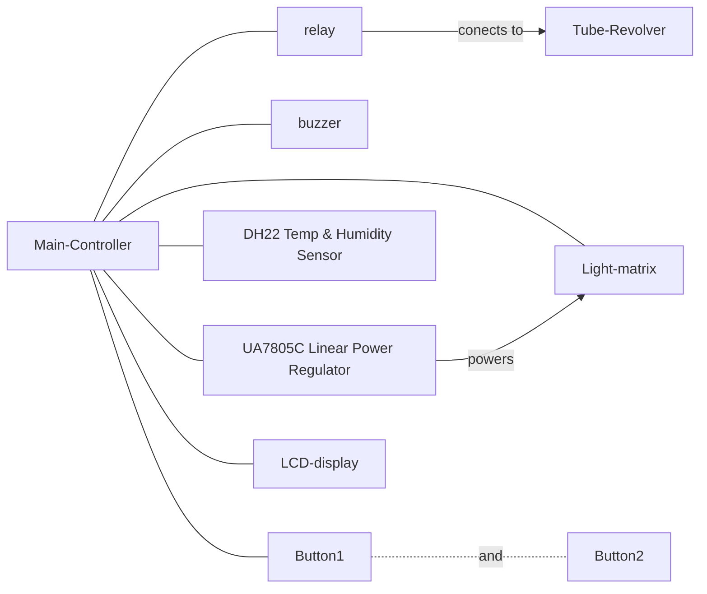
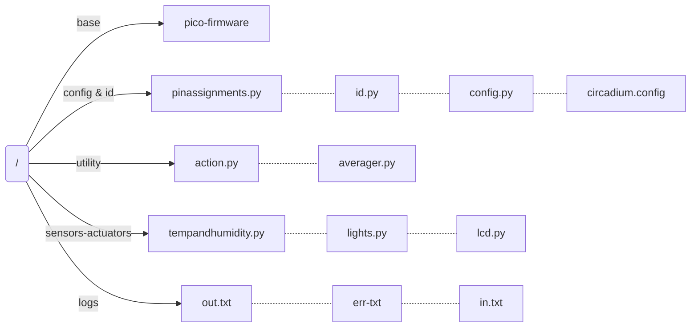
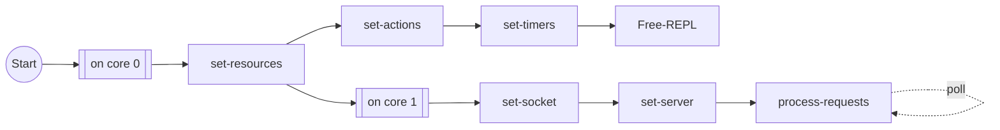
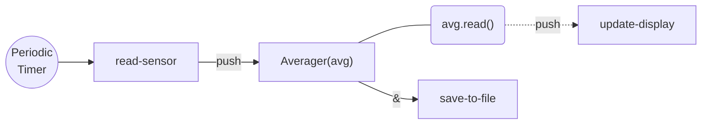
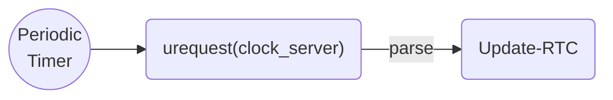
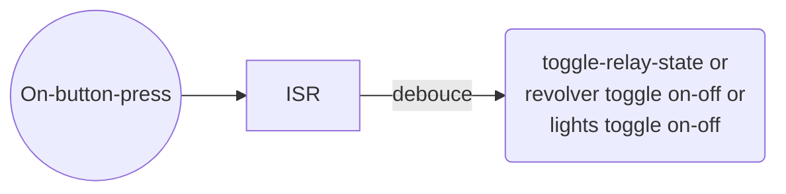
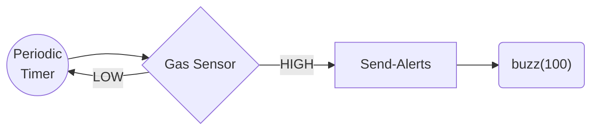

# pico-incubator

Resources for in-house cell incubator controller based on Raspberry Pi Pico W. The device is programmed in RPi Pico W Micropython (latest version).


The incubator's main purpose is to maintian light conditions and record temperature and humidity for the cell culture growth of *Chlamydomonas reinhardtii*. The apparatus has a main controller board and some attached peripherals.




## Functional Analysis

**Incubator Controller manages the following things:**

1. Temperature and Humidity Monitor —  Sampling Rate: 1 Sample/min : Maintains averages per hour.
2. Syncronisation of date and time using Wifi— Sync Rate: 1 Sample / 15 mins
   + Server: www.ntp.ntsc.ac.cn (This would work better but no mechanism of using it: Potential Server:  "http://worldtimeapi.org/api/timezone/Europe/Lisbon")
3. Synchronisation Light Controls: Fix R, G, B intensity and perform a sequence routine (day and night cycles)
4. Actuation of tube-revolver using relay module (1 unit).
5. LCD display for monitoring conditions.

---

**Planned features that were not implemented:**

1. Manual controls using Buttons and Potentiometers — buzzer based feedback.

   [At this point, the potentiometer is not required and the port will be reused for something]

2. Fire safety mechanism: Read presence of Carbon-based gases and sound an alarm if a threat is detected.
   [Sensor consumers high current and will heat the ambient environment.]

3. Power backup using 5V power rails.

   [Required Shottkey diodes, which are not in stock.]


## File Structure




## List of Timers

1. `dt_sync_tim` : Date-time synchronisation of Real Time Clock (RTC).
2. `buzzer_safety_tim` : Turns off the buzzer every 5 minutes to protect against accidental crashes while the buzzer is on.
3. `sensor_act_timer` : 
   1. `tanh_tim` : Samples the temperature and humidity at regular intervals.
   2. `lcd_update1_tim`:  Pushes the next update on the LCD.

4. `circadium_scheduler`:  Toggles the ligthts based on circadium rhythm.


## List of Actions

1. Switch-1 toggles relay.
 2. Switch-2 toggles LCD updates.

## List of External Peripherals

1. UA7805C 5V 1.5A Linear Voltage Regulator connected to 9V independent powersupply.
2. Generic Passive Buzzer
3. Generic One channel Relay Switch
4. 2 Buttons/Switches
5. DFRobot DH22 Temperature and Humidity Sensor : https://www.dfrobot.com/product-1102.html
6. 21 Neopixel RGB LEDs
7. Waveshare 0.96" color LCD with ST7735S driver: https://www.waveshare.com/wiki/Pico-LCD-0.96

## Control Flow

1. Main Routine



2. Set-Temperature and Humidity Averagers



3. Recurring Callbacks for date and time sync



4. Interrupt Routine with Actions (Switch 1 and Switch 2):



5. Fire Alarm Triggers [feature not implemented]

+ The Gas Sensor must be warmed up for 5-10 minutes before it can be read.
+ If the Gas Sensor has remained unused for a long time, it must be preheated for 24 hours atleast.
+ The sensor consumes about ~800 mW of power.




6. Power Rail Detection [feature not implemented]

   ​	No clue as of now on how to do it.

   ```mermaid
   graph LR
   	Detect{Detect<br>Power<br>Rail} --> detection_mechanism{{detection mechanism}}--> buzz("Buzzer feedback")
   	
   ```
   
   7. Watchdog timer to correct for crashes [feature not implemented]
   
      ```python
      from machine import WDT
      wdt = WDT(timeout=2000)  # enable it with a timeout of 2s
      wdt.feed()
      ```

On rp2040 devices, the maximum timeout is 8388 ms. So the device would reset every 8 seconds. However, the wifi connection time is connected 3 seconds. This would not work.

## Illumination Scheduler

### Day-Night Cycles

The actuation of day night cycles requires the complete description of the following entities:

1. (day_len_hours, night_len_hours, start_time, day_start)
2. (day_start,  night_start) : Obviously the easiest.

#### [TODO] mode == "long"

Two callbacks per cycle by precision calculation of time difference between phases. Not solved.

#### mode == "short"

The current time (**now**)  is compared to the schedules time(s), and the change of lights is executed if there is a match. This is essentially a polling approach.

**<u>Correctly timing the change of lights with *minute* precision is a complex problem because:</u>**

1. The time is checked every 30-45 seconds (accurately described by the `config.cs_callback_s`. Hence, the comparision is always slighly mismatched.
2. The comparision must keep track of difference in dates.
3. The comparision must be debounced with last callback time to make sure that non-absolute differences (difference of +1 and -1), both don't lead to execution.
4. The lights must be set to the correct state when the device is booted.


**<u>A change is allowed when the following conditions are wholly satisfied:</u>**

1. The difference of time (now and set time) in seconds must be less-than or equal to 2*`config.cs_callback_s.
2. The last actuation of that *phase* (day or night phase) must debounce the next for atleast 5 minutes. (not conserved on reboot)
3. There must be enough cycles remaining for the execution. Each phases decreases the `remaining_cycle_count` by 0.5.
   [**!!! Requirement allows `cycles` parameter to be a float.**]
4. 

### [TODO] Multiple CircadiumScheduler objects


Proto-code for Daisy-chaining of multiple C-Scheduler objects to contruct a complex synchronisation cycle.

```python
# Schedule Parser
class ScheduleParser:
  
  def __init__(self, filename):
    
    #Some file that contains Schedule information
    
    lines = file.readlines()
    lines = [line.replace(" ", "") for line in lines]
    lines = [line.split(",") for line in lines]
    				# r             g             b             t_sec
    schedules = \
    [Schedule(int(line[0]), int(line[1]), int(line[2]), float(line[3])) for line in lines]
    return schedules
```


### LED Matrix — Current Requirement Analysis

+ Source: https://learn.adafruit.com/adafruit-neopixel-uberguide/powering-neopixels

+ LM7805C Linear Voltage Regulator: 

+  Adding a 300 to 500 Ohm resistor between your microcontroller's data pin and the data input on the first NeoPixel can help prevent voltage spikes that might otherwise damage your first pixel. Please add one between your micro and NeoPixels!

+ Before connecting a NeoPixel strip to ANY source of power, a large capacitor (500–1000** **µ****F at 6.3 Volts or higher) across the + and – terminals provides a small power reservoir for abrupt changes in brightness that the power source might not otherwise handle — a common source of NeoPixel “glitching.”

+ To estimate power supply needs, multiply the number of pixels by 20, then divide the result by 1,000 for the “rule of thumb” power supply rating in Amps. Or use 60 (instead of 20) if you want to guarantee an absolute margin of safety for all situations. For example:

  60 NeoPixels × 20 mA ÷ 1,000 = 1.2 Amps minimum
  60 NeoPixels × 60 mA ÷ 1,000 = 3.6 Amps maximum

+ **For Our Case**: 21 LEDs:

  + 21 × 20mA / 1000  = 410/1000 = 0.41 A
  + 21 × 60mA / 1000 = 1260/1000 = 1.26A

+ Rating for LM7805C is 5A ad 1.5A maximum. Therefore, it is being used **around** its full capacity. The Regulator has thermal protection shutdown.

+ **How to detect thermal shutdowns? : Use a Photosensor module with an IRQ on a minimum threshold raising an error.** For this to be reliable, the box needs to be closed-shut with magnets. Port for Potentiometer is free and is connected to an Analog Read Pin (ADC).

### Add-on Current Source


To add additional LED-matrix, a seperate current source with its own LM7805C Linear Voltage Regulator should be added with seperate Neopixel control pins. The same AC/DC converter power source with enough current input can be used.


