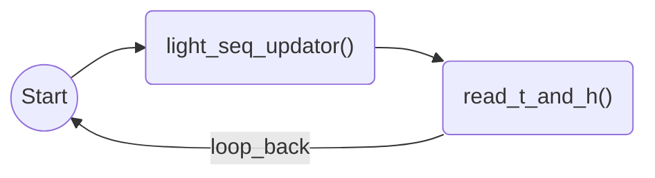
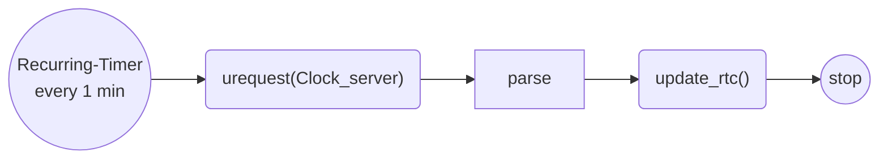
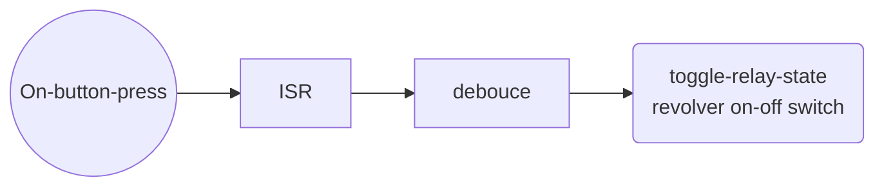
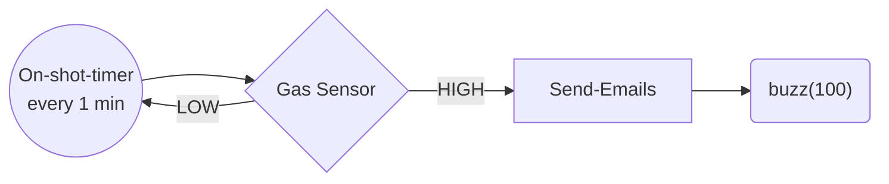
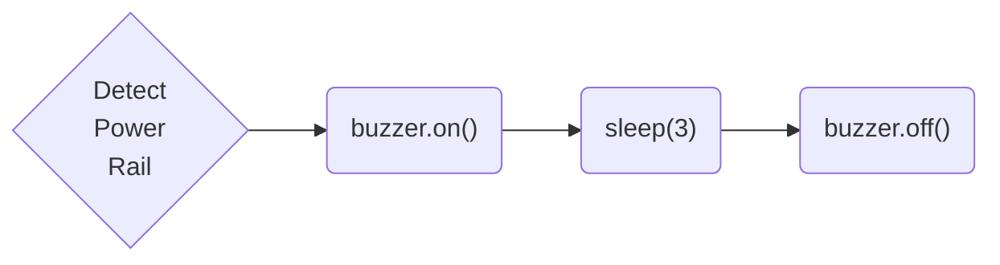

# pico-incubator

Resources for in-house cell incubator controller based on Raspberry Pi Pico W.


Programming Time: 2 hours

Debugging Time: 2 hours

---

Incubator Controller manages the following things:

1. Temperature and Humidity Monitor —  Sampling Rate: 1 Sample/min
2. Syncronisation of date and time using Wifi— Sync Rate: 1 Sample / 15 mins
   + Server:  "http://worldtimeapi.org/api/timezone/Europe/Lisbon"
3. Light Controls: Fix R, G, B intensity and perform a sequence routine (day and night cycles)
4. Actuation of tube-revolver using relay module.

---

Optional features:

1. Manual controls using Buttons and Potentiometers — buzzer based feedback.
2. Power backup using 5V power rails.
3. Fire safety mechanism: Read presence of Carbon-based gases and sound an alarm if a threat is detected.


## Control Flows

1. Main Routine



2. Recurring Callbacks for date and time sync



```python
dt_sync_timer.init()

def dt_sync_callback():
  dt_sync_flag = True
  
def dt_sync():
  
```


3. Interrupt Routine for tube-revolver:



```python
def isr_button2():
  sleep(butt_debtime)
  if button2.on():
    relay_toggle_flag = True
  		  
```


## Code

```python
# Swithches
global day_night_cycle = True
global day_in_hours = 12
global night_in_hours = 12
global night_start = False
global light_scheduler = False


# /////////////////////////////////////////////////////////////////////////////////////
# /////////////////////////////////////////////////////////////////////////////////////
# /////////////////////////////////////////////////////////////////////////////////////
# /////////////////////////////////////////////////////////////////////////////////////
# /////////////////////////////////////////////////////////////////////////////////////
# /////////////////////////////////////////////////////////////////////////////////////


# Gloabl Resources
global timer
timer = Timer(mode=Timer.ONE_SHOT)
buzzer = machine.Pin(pinassignments.buzzer, Pin.OUT)
wifi = Wifi(secrets)
rtc = machine.RTC(year, month, day[, hour[, minute[, second)
relay = machoine.Pin(pinassignments.relay, Pin.OUT) 

schedules = ScheduleConstructor(lights.schedule)
                                                   

# Global flags
global lights_sch_flag = False
global light_sch_itr = 0
global last_day_night_toggle = None
global day_night_toggle_count = 0
global day_night_flag = True                                              
gloabl relay_toggle_flag = False
def main():
  
  # Validation
  if not day_in_hours + night_in_hours == 24.0:
    print("Day Night Split is not 24 hours!")
    buzz(3)
 
 	# Loop 
  while True:
                                                   
    if relay_toggle_flag:
       relay.toggle()
       print(f"Tube Revolver state toggled to: {relay.value()}")
   
  	# Light Schedule Mode ----------------------------------------------------
  	if light_scheduler and lights_sch_flag:
    	sch = schedules[i]
      lights.set_all(sch.r, sch.g, sch.b)
      lights_sch_flag = False
      
    	def callback(Schedule):
      	light_sch_itr = light_sch_itr + 1
        lights_sch_flag = True
        print(light_sch_itr)
    	
      tim.init(mode=Timer.ONE_SHOT, period=sch.t_sec*1000, callback=set_lights)
     # ------------------------------------------------------------------------
    
    
    # Day Night Cycles ---------------------------------------------------------
    if day_night_cycle and (day_night_flag or day_night_toggle_count == 0):
      day_night_toggle_count = day_night_toggle_count + 1
      last_day_night_toggle = rtc.now()
       
      if day_night_toggle_count%2 + int(night_start)== 0: # DAY
        hours = day_in_hours
      else:                                               # NIGHT
        hours = night_in_hours
      dn_timer.init(mode=Timer.ONE_SHOT, period=hours*3600*1000, 
                    callback=lambda: day_night_flag = not day_night_flag)
     # ------------------------------------------------------------------------
      

    
```

## Illumination Scheduler

```python
class IlluminationScheduler:
  
  end_flag = False
  
  def day_night(self, day_hours, night_hours, no_cycles=None):
    pass
  
  
      
      def mycallback(t):
    pass

tim.init(mode=Timer.ONE_SHOT, period=sch.t_sec*1000, callback=set_lights)

  
  
# A Schedule is a vector of SchedulePoints
class SchedulePoint:
  def __init__(self, r, g, b, t_sec):
  	self.r = r
  	self.g = g
    self.b = b
    self.t_sec = t_sec
  
  
# Schedule Parser
class ScheduleParser:
  
  def __init__(self, filename):
    
    #Some file that contains Schedule information
    
    lines = file.readlines()
    lines = [line.replace(" ", "") for line in lines]
    lines = [line.split(",") for line in lines]
    				# r             g             b             t_sec
    schedules = \
    [Schedule(int(line[0]), int(line[1]), int(line[2]), float(line[3])) for line in lines]
    return schedules
```


## Buzzer

```python
def buzz(count=1):
  global buzzer
	for _ in range(3):
      buzzer.on()
      sleep(1)
      buzzer.off()
      sleep(1)
```


## Fire Alarm



## Power Rail Actuation



