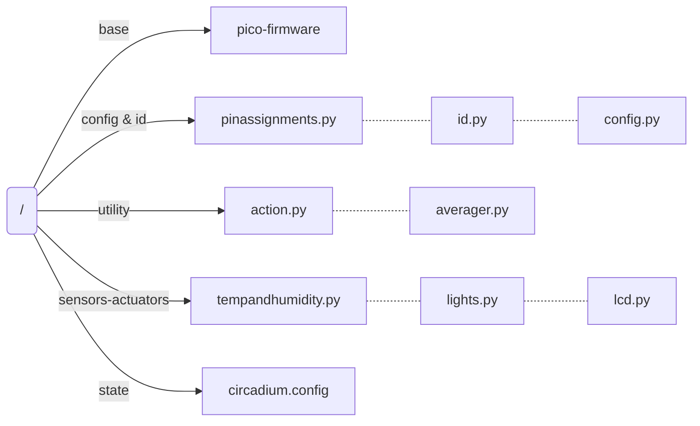
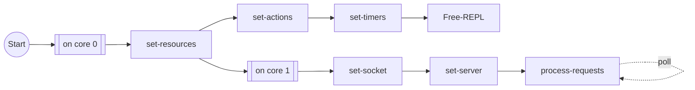
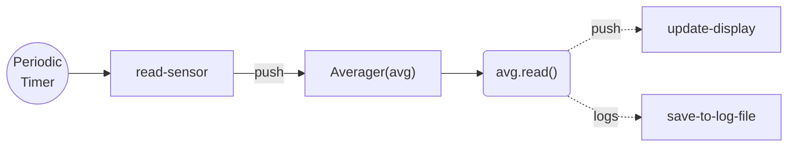
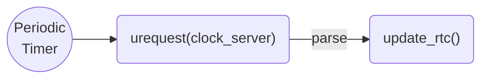
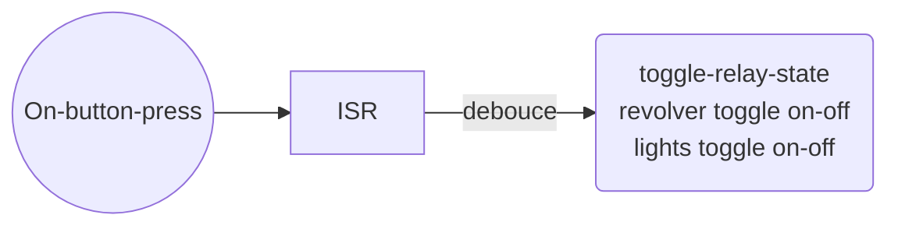
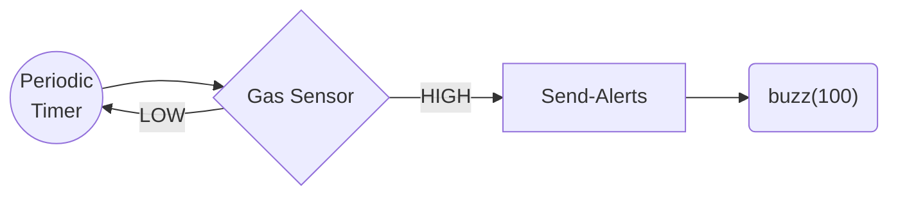

# pico-incubator

Resources for in-house cell incubator controller based on Raspberry Pi Pico W.

---

Incubator Controller manages the following things:

1. Temperature and Humidity Monitor —  Sampling Rate: 1 Sample/min : Maintains averages per hour.
2. Syncronisation of date and time using Wifi— Sync Rate: 1 Sample / 15 mins
   + Server:  "http://worldtimeapi.org/api/timezone/Europe/Lisbon"
3. Light Controls: Fix R, G, B intensity and perform a sequence routine (day and night cycles)
4. Actuation of tube-revolver using relay module.
5. Power backup using 5V power rails.

---

Optional features:

1. Manual controls using Buttons and Potentiometers — buzzer based feedback.
3. Fire safety mechanism: Read presence of Carbon-based gases and sound an alarm if a threat is detected.


## File Structure




## List of Timers

1. `dt_sync_tim` : Date-time synchronisation of Real Time Clock (RTC).
2. `buzzer_safety_tim` : Turns off the buzzer every 5 minutes to protect against accidental crashes while the buzzer is on.
3. `sensor_act_timer` : 
   1. `tanh_tim` : Samples the temperature and humidity at regular intervals.
   2. `lcd_update1_tim`:  Pushes the next update on the LCD.

4. `circadium_scheduler`:  Toggles the ligthts based on circadium rhythm.


## List of Actions

1. Switch-1 toggles relay.
 2. Switch-2 toggles lights.

## List of External Peripherals

1. UA7805C 5V 1.5A Linear Voltage Regulator connected to 9V independent powersupply.
2. Generic Passive Buzzer
3. Generic One channel Relay Switch
4. 2 Buttons/Switches
5. DFRobot DH22 Temperature and Humidity Sensor
6. 21 Neopixel RGB LEDs
7. Waveshare 0.96" color LCD with ST7735S driver: https://www.waveshare.com/wiki/Pico-LCD-0.96

## Control Flow

1. Main Routine



2. Set-Temperature and Humidity Averagers



3. Recurring Callbacks for date and time sync



4. Interrupt Routine with Actions (Switch 1 and Switch 2):



5. Fire Alarm Triggers [disconnected as of now]

+ The Gas Sensor must be warmed up for 5-10 minutes before it can be read.
+ If the Gas Sensor has remained unused for a long time, it must be preheated for 24 hours atleast.
+ The sensor consumes about ~800 mW of power.




6. Power Rail Detection

   ​	No clue as of now on how to do it.

   ```mermaid
   graph LR
   	Detect{Detect<br>Power<br>Rail} --> b_on("buzzer.on()") --> sleep("sleep(3)") --> b_off("buzzer.off()")
   	
   	
   ```

   7. Watchdog timer to correct for crashes

      ```python
      from machine import WDT
      wdt = WDT(timeout=2000)  # enable it with a timeout of 2s
      wdt.feed()
      ```

On rp2040 devices, the maximum timeout is 8388 ms.

## Code

```python
# Swithches
global day_night_cycle = True
global day_in_hours = 12
global night_in_hours = 12
global night_start = False
global light_scheduler = False


# /////////////////////////////////////////////////////////////////////////////////////
# /////////////////////////////////////////////////////////////////////////////////////
# /////////////////////////////////////////////////////////////////////////////////////
# /////////////////////////////////////////////////////////////////////////////////////
# /////////////////////////////////////////////////////////////////////////////////////
# /////////////////////////////////////////////////////////////////////////////////////


# Gloabl Resources
global timer
timer = Timer(mode=Timer.ONE_SHOT)
buzzer = machine.Pin(pinassignments.buzzer, Pin.OUT)
wifi = Wifi(secrets)
rtc = machine.RTC(year, month, day[, hour[, minute[, second)
relay = machoine.Pin(pinassignments.relay, Pin.OUT) 

schedules = ScheduleConstructor(lights.schedule)
                                                   

# Global flags
global lights_sch_flag = False
global light_sch_itr = 0
global last_day_night_toggle = None
global day_night_toggle_count = 0
global day_night_flag = True                                              
gloabl relay_toggle_flag = False
def main():
  
  # Validation
  if not day_in_hours + night_in_hours == 24.0:
    print("Day Night Split is not 24 hours!")
    buzz(3)
 
 	# Loop 
  while True:
                                                   
    if relay_toggle_flag:
       relay.toggle()
       print(f"Tube Revolver state toggled to: {relay.value()}")
   
  	# Light Schedule Mode ----------------------------------------------------
  	if light_scheduler and lights_sch_flag:
    	sch = schedules[i]
      lights.set_all(sch.r, sch.g, sch.b)
      lights_sch_flag = False
      
    	def callback(Schedule):
      	light_sch_itr = light_sch_itr + 1
        lights_sch_flag = True
        print(light_sch_itr)
    	
      tim.init(mode=Timer.ONE_SHOT, period=sch.t_sec*1000, callback=set_lights)
     # ------------------------------------------------------------------------
    
    
    # Day Night Cycles ---------------------------------------------------------
    if day_night_cycle and (day_night_flag or day_night_toggle_count == 0):
      day_night_toggle_count = day_night_toggle_count + 1
      last_day_night_toggle = rtc.now()
       
      if day_night_toggle_count%2 + int(night_start)== 0: # DAY
        hours = day_in_hours
      else:                                               # NIGHT
        hours = night_in_hours
      dn_timer.init(mode=Timer.ONE_SHOT, period=hours*3600*1000, 
                    callback=lambda: day_night_flag = not day_night_flag)
     # ------------------------------------------------------------------------
      

    
```

## Illumination Scheduler

### Day-Night Cycles

The actuation of day night cycles requires the complete description of the following entities:

1. (day_len_hours, night_len_hours, start_time, day_start)
2. (day_start, night_start)

```python
class CircadiumScheduler:
  	def __init__(self):
      self.day_start   = "07:00"
			self.night_start = "20:00"
			self.cycles      = None
      
    def set_day_conditions():
      pass
    def set_night_conditions():
      pass
      
    
    def time_based(day_start, night_start, cycles=None):
      """
      Input hours::minutes in 24 hour format.
      cycles = None : Run cycle forever.
      """
      if is_valid_time(day_start) and is_valid_time(night_start):
      		self.day_start   = day_start
					self.night_start = night_start
					self.cycles      = cycles
          
      with open(circadium.config) as file:
        file.write(f"{day_start}\n{night_start}\n{cycles}\n")
        
      self.set_timers(
```


```python
class IlluminationScheduler:
  
  end_flag = False
  
  def day_night(self, day_hours, night_hours, no_cycles=None):
    pass
  
  
      
      def mycallback(t):
    pass

tim.init(mode=Timer.ONE_SHOT, period=sch.t_sec*1000, callback=set_lights)

  
  
# A Schedule is a vector of SchedulePoints
class SchedulePoint:
  def __init__(self, r, g, b, t_sec):
  	self.r = r
  	self.g = g
    self.b = b
    self.t_sec = t_sec
  
  
# Schedule Parser
class ScheduleParser:
  
  def __init__(self, filename):
    
    #Some file that contains Schedule information
    
    lines = file.readlines()
    lines = [line.replace(" ", "") for line in lines]
    lines = [line.split(",") for line in lines]
    				# r             g             b             t_sec
    schedules = \
    [Schedule(int(line[0]), int(line[1]), int(line[2]), float(line[3])) for line in lines]
    return schedules
```


