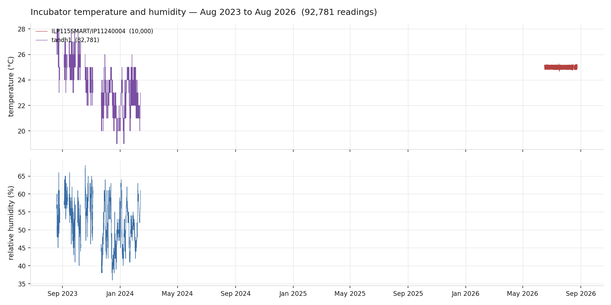
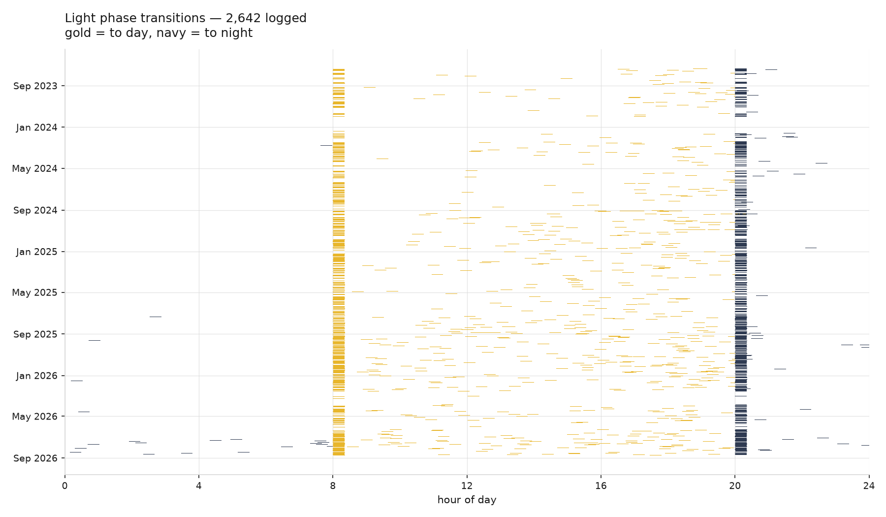
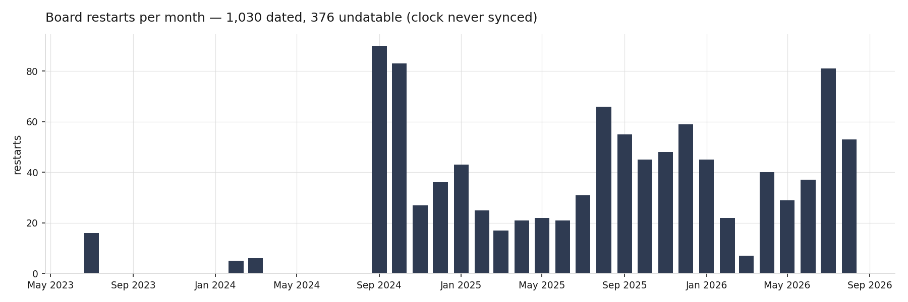
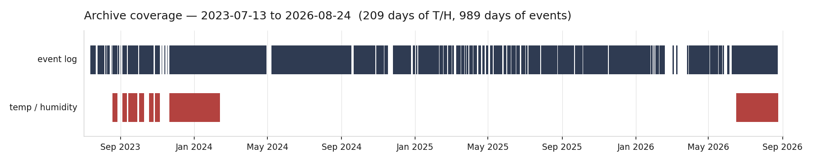

# pico-incubator — log archive

Permanent record of the cell-culture incubator run by a Raspberry Pi Pico:
light cycle, board restarts, and — for the first six months — temperature and
humidity.

This repository is now an **archive**. The firmware that produced these logs is
no longer developed here; it was folded into `pico_firmware`, which unified all
Pico-controlled devices in the lab. The original code is preserved two ways:

- the **`legacy` branch**, which is this repository exactly as it was before the
  reorganisation
- the **`legacy/` folder** on `main`, for convenience

Note that the legacy code targets a **different circuit board** to the one in
service now. See `legacy/README.md`.

---

## Figures

Regenerated automatically on every push. See *How it works* below.

### Temperature and humidity



### Light phase transitions



Two dense columns at 08:00 and 20:00 are the scheduled transitions. The scatter
through the working day is the boot-time phase detection that runs whenever the
circuit file is re-executed.

### Board restarts



A restart is a bare channel-name line — the header the Logger writes on import.
It carries no timestamp, so each one is dated from the first record of that
boot. Boots whose clock never synced cannot be dated and are excluded from the
bars but counted in the title. The folder name is only the retrieval date and is
never used as a time axis.

### Archive coverage



---

## Adding logs

1. Pull the `.txt` files off the Pico.
2. Put them in a new folder named for the date you retrieved them, ISO format:
   `logs/YYYY-MM-DD/`.
3. Commit and push.

The plots and CSVs regenerate themselves. Nothing to run locally.

---

## How it works

`.github/workflows/archive.yml` runs on every push that touches `logs/` or
`tools/`:

1. `tools/parse_logs.py` — walks `logs/*/`, parses every record, writes
   `tandh.csv` and `events.csv`
2. `tools/make_plots.py` — writes the four PNGs into `plots/`
3. commits the regenerated files back to the branch

Both scripts run from the repository root and take no arguments. `parse_logs.py`
is standard library only; `make_plots.py` needs matplotlib.

---

## The data

| | |
|---|---|
| Retrievals | 17, from 2023-08-26 to 2026-08-23 |
| Temperature / humidity | 82,781 readings, 2023-08-19 → 2024-02-12 |
| Event records | ~29,000 |
| Days with event data | 989 |
| Days with T/H data | 139 |

### Log format

Every file is written by the Pico's `Logger`, one record per line:

```
<channel>, (Y, M, D, weekday, hh, mm, ss, subsec), <message>
```

A bare channel name on its own line is the header written when the logger is
imported — that is, **one board restart**. All four channels write a header at
boot, so counting restarts across every channel over-counts about fourfold;
`make_plots.py` counts only `out`.

| file | content |
|---|---|
| `out.txt` | boots, scheduler setup, day/night transitions |
| `err.txt` | NTP clock-sync records |
| `tandh1.txt`, `tandh2.txt` | `{'humidity': 44, 'temp': 23}` |
| `in.txt`, `dtsync.txt` | headers only in practice |

### Two things that look like bugs but are not

**Temperature and humidity stop in February 2024.** Not data loss — the new
incubator arrived, with its own environmental control, and the sensor was no
longer needed. Everything after that date is light cycle and uptime only.

**Some records are stamped 2021-01-01.** The MicroPython RTC default. It means
the NTP / `dtsync` clock sync had not succeeded for that boot. There was no
watchdog on this hardware, so these are sync failures and nothing more. They are
kept in `events.csv` with `clock_ok=0`, and excluded from `tandh.csv`, where an
unusable timestamp makes the reading worthless.

### Retrieval windows do not overlap

Each pull captured a distinct window — roughly a week for the 2023 retrievals —
rather than a cumulative file. All 82,781 T/H readings are unique. The plots
break the line across gaps rather than interpolating, so what you see is what
was actually recorded.
