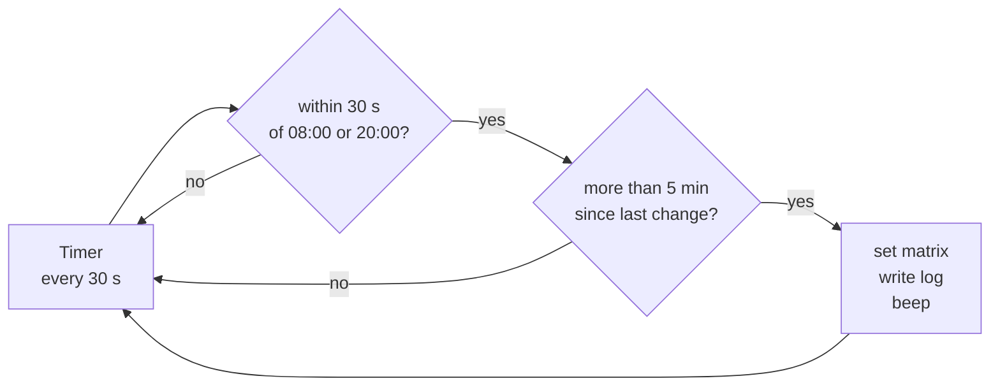

# Light cycle

The incubator runs 12 hours of light and 12 of darkness: white at 08:00, off at 20:00.
A 132-pixel LED matrix, driven by a scheduler that wakes every 30 seconds and asks
whether it is time to change.

## Every transition, three years

One row per date, a mark at the hour of each logged transition. Gold is a change to
day, navy a change to night.

**The two dense columns are the schedule working.** Transitions land within seconds of
08:00 and 20:00 whenever the board is running — across three years, essentially without
exception.

**The scatter through the working day is not a fault.** Whenever the circuit file is
re-executed — every time the code is run from Thonny — the scheduler calls
`phase_detect` at startup and applies the correct phase immediately. Those boot-time
applications are logged as transitions too. They cluster between 09:00 and 20:00
because that is when someone is at the bench.

**The blank stretches are the real problem.** Where a row is empty, nothing was logged
that day, and the log alone cannot say whether the board was unplugged or frozen with
the lights stuck on. Two stretches stand out: 17 February to 3 March 2026, and 10 to 27
March 2026 — fourteen and seventeen days with no transitions recorded.

## How the schedule works, and how it can fail

The window is one minute wide and the check is **edge-triggered with no memory**. If a
tick is delayed past the target minute, that transition is lost for the whole twelve
hours — the scheduler has no notion of "the lights should be on and they are not".

In practice this has never been observed to fire: two ticks per minute is enough, and
the actogram shows the transitions landing reliably. But it is a single point of
failure with no recovery, and the robust form is a level check — compute the phase the
current time implies, compare against what is applied, and correct — rather than
watching for an edge.

## One confirmed bug

At exactly 20:00, `phase_detect` returns **"day"**. The boundary test is inclusive on
the wrong side, so a board that boots inside that minute drives the matrix to full
white at nightfall. The 30-second scheduler corrects it on the next tick.

Caught twice in the log, on 20 January 2026 and 2 November 2025 — a boot at `20:00:13`,
white at `20:00:15`, night restored at `20:00:56`. Forty seconds of light. Minor, but
real, and a one-character fix.
